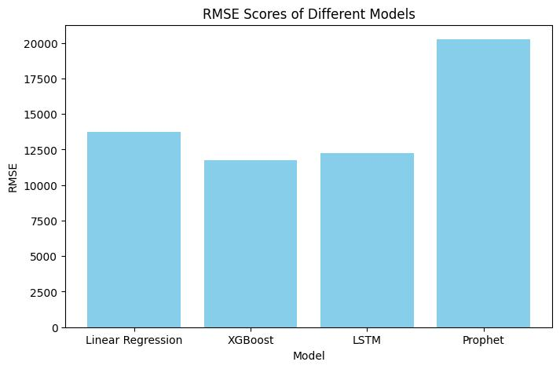

# Time-Series-Sale-Forecast

## Overview 

This project aims to develop a sales forecasting system using various machine learning models including XGBoost, Prophet, and LSTM. The goal is to predict future sales based on historical data, enabling better inventory management and resource allocation for the business.

## Model Selection and Evaluation

### XGBoost
XGBoost is a popular gradient boosting algorithm known for its performance and scalability. We trained an XGBoost model on the dataset and evaluated its performance using root mean square error (RMSE) as the evaluation metric.

### Prophet
Prophet is a forecasting tool developed by Facebook that is specialized for time series data. We implemented a Prophet model to capture the seasonality and trends in the sales data. The evaluation was performed using RMSE.

### LSTM (Long Short-Term Memory)
LSTM is a type of recurrent neural network (RNN) well-suited for sequence prediction tasks. We developed an LSTM model to learn the temporal patterns in the sales data. RMSE was used as the loss function during training.


## Compare Models



## Future Improvements

- Explore feature engineering techniques to improve model performance
- Fine-tune hyperparameters for better model accuracy
- Experiment with ensemble methods to combine predictions from multiple models

## Requirements

```Bash
pyenv local 3.11.3
python -m venv .venv
source .venv/bin/activate
pip install --upgrade pip
pip install -r requirements.txt
```

